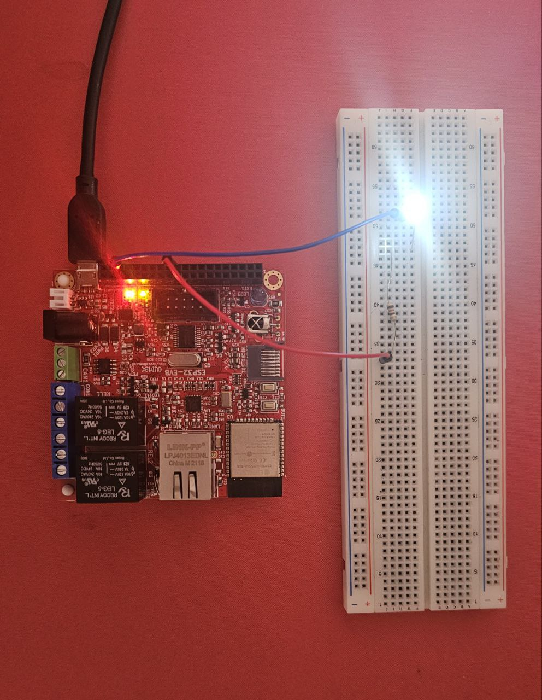

Control Brightness of LED using ESP32:

assignment: Connect an LED series with a 120 resistor to a pwm pin (21). Make the LED fading in/out with 5 steps using a PWM signal. For timing use the millis function with interval 50 ms.

